# 🎵 LyciaMusic 歌曲标签信息数据流程总结

本文档旨在梳理当前软件获取歌曲标签信息的完整数据流程，帮助开发者或 AI 理解本地扫描与在线匹配的核心逻辑。

## 1. 核心流程概览

软件获取歌曲标签信息主要通过 **两条独立的数据流**：

1.  **本地标签扫描流程 (Local Scan)**：
    *   **时机**：用户点击“扫描音乐库”或软件启动时自动检测。
    *   **来源**：音频文件内嵌的元数据标签 (ID3, Vorbis Comments, FLAC Tags)。
    *   **目的**：构建本地数据库，供播放列表展示。

2.  **在线标签匹配流程 (Online Matching)**：
    *   **时机**：用户手动触发“匹配标签”或“一键自动匹配”。
    *   **来源**：在线音乐平台 API (网易云音乐/QQ音乐)。
    *   **目的**：修复或补全缺失的标签信息，并**回写**到音频文件中。

---

## 2. 详细数据流解析

### 2.1 本地标签扫描流程 (Local Scan)

此流程负责从磁盘读取文件信息并存入 SQLite 数据库。

```mermaid
sequenceDiagram
    participant User as 用户
    participant FE as 前端 (Vue)
    participant BE_Scan as 后端 (scanner.rs)
    participant Lofty as Lofty 库
    participant SQLite as SQLite 数据库
    participant File as 本地音频文件

    User->>FE: 点击 "添加文件夹" 或 "重新扫描"
    FE->>BE_Scan: invoke('scan_music_folder', { path })
    
    rect rgb(30, 30, 30)
        Note right of BE_Scan: 核心扫描逻辑
        BE_Scan->>SQLite: 1. 获取当前数据库快照 (路径, 修改时间, 大小)
        BE_Scan->>File: 2. 遍历磁盘文件 (walkdir)
        
        loop 每个音频文件
            BE_Scan->>BE_Scan: 比较 文件mtime/size 与 数据库记录
            
            alt 文件新增 或 已修改
                BE_Scan->>Lofty: 3. 解析文件标签
                Lofty->>File: 读取 ID3/FLAC 标签
                Lofty-->>BE_Scan: TaggedFile 对象
                Note right of BE_Scan: 提取: Title, Artist, Album, Duration,<br>Bitrate, SampleRate
            else 文件未修改
                BE_Scan->>SQLite: 直接使用数据库缓存数据
            end
        end
        
        BE_Scan->>SQLite: 4. 事务批量写入 (INSERT OR REPLACE)
        BE_Scan->>SQLite: 5. 清理已删除的文件记录
    end

    BE_Scan-->>FE: 返回最新歌曲列表 Vec<Song>
    FE->>User: 刷新歌曲列表 UI
```



**关键技术点：**
*   **Rust 库**: `walkdir` (遍历), `lofty` (标签解析), `rusqlite` (数据库)。
*   **性能优化**: 差异化更新（只解析修改过的文件），事务批量提交。
*   **代码位置**: `src-tauri/src/music/scanner.rs` -> `scan_single_directory_internal`

---

### 2.2 在线标签匹配流程 (Online Matching)

此流程负责从网络获取元数据，并将其写入到本地音频文件的头部。

```mermaid
sequenceDiagram
    participant FE_Modal as TagMatchModal.vue
    participant BE_Matcher as 后端 (tag_matcher.rs)
    participant OnlineAPI as 网易/QQ API
    participant Lofty as Lofty 库
    participant File as 本地音频文件

    Note over FE_Modal, OnlineAPI: Phase 1: 搜索与匹配
    FE_Modal->>BE_Matcher: invoke('search_online_tags', { keyword, source })
    
    alt Source == Netease
        BE_Matcher->>OnlineAPI: POST music.163.com/api/search/get (加密参数)
        OnlineAPI-->>BE_Matcher: JSON Response
        BE_Matcher->>OnlineAPI: GET /song/detail (获取高清封面)
    else Source == QQ
        BE_Matcher->>OnlineAPI: GET c.y.qq.com/.../client_search_cp
    end
    
    BE_Matcher-->>FE_Modal: 返回 Vec<OnlineSongMetadata>
    FE_Modal->>FE_Modal: 用户选择正确的匹配项

    Note over FE_Modal, File: Phase 2: 写入标签
    FE_Modal->>BE_Matcher: invoke('write_music_tags', { path, metadata, options })
    
    group 标签写入逻辑
        BE_Matcher->>OnlineAPI: 下载封面图片 (fetch_image_data)
        BE_Matcher->>Lofty: 打开文件 Probe::open(path)
        
        BE_Matcher->>Lofty: 设置字段:
        Note right of BE_Matcher: set_title, set_artist, set_album<br>set_year, set_track, set_genre<br>push_picture (封面)
        
        Lofty->>File: 保存更改 (save_to_path)
    end
    
    BE_Matcher-->>FE_Modal: 成功 (Ok)
    FE_Modal->>FE_Modal: 提示用户重新扫描以更新显示
```

**关键数据结构 (`OnlineSongMetadata`)：**
*   `title`, `artist`, `album`: 基础信息。
*   `cover_url`: 用于下载封面写入文件。
*   `year`: 发布年份（从时间戳计算）。
*   `track_number`: 轨道号（QQ音乐支持较好）。
*   `source`: 来源标识。

**代码位置**: `src-tauri/src/music/tag_matcher.rs`

---

## 3. 数据一致性模型

*   **单一数据源 (Source of Truth)**：**音频文件本身**。
    *   数据库 (`songs` 表) 仅仅是文件标签的**缓存**。
    *   在线匹配操作本质上是**修改文件**。
    *   修改文件后，必须触发“扫描”流程，才能让数据库和 UI 更新显示。

## 4. 关键文件索引

| 模块 | 文件路径 | 职责 |
| :--- | :--- | :--- |
| **扫描器** | `src-tauri/src/music/scanner.rs` | 遍历目录，调用 lofty 读取标签，维护数据库一致性。 |
| **匹配器** | `src-tauri/src/music/tag_matcher.rs`| 对接在线 API (搜索/下载)，调用 lofty *写入* 标签。 |
| **数据库** | `src-tauri/src/database.rs` | 定义 `songs` 表结构，处理 SQLite 连接。 |
| **类型定义** | `src-tauri/src/music/types.rs` | 定义 `Song` (本地) 和其他共享结构体。 |
| **前端交互** | `src/components/settings/TagMatchModal.vue` | 提供搜索 UI，调用匹配和写入命令。 |
