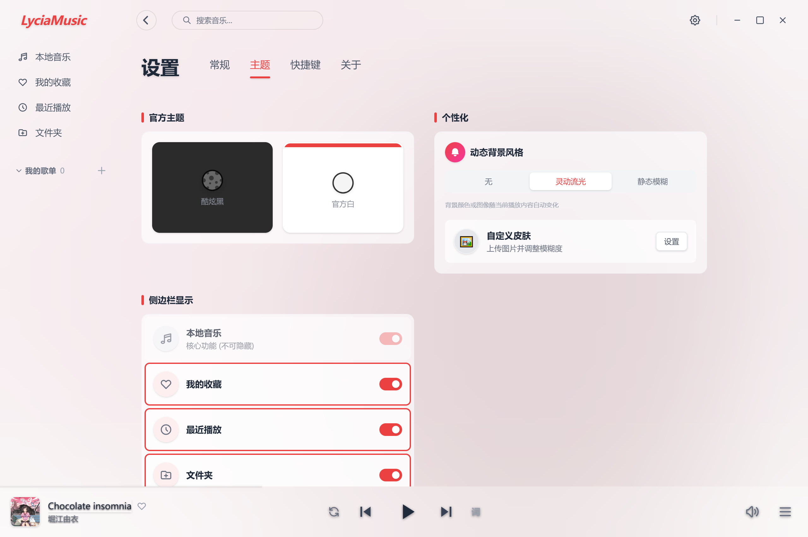

<div align="center">

**简体中文 | [English](./README_EN.md)**

</div>

---


# LyciaMusic 🎵 | 莉西亚音乐

一款基于 **Tauri v2.0**、**Vue 3** 和 **TypeScript** 开发的高性能桌面本地音乐播放器。专注于极致的视觉美感、流畅的交互体验以及原生级的系统集成。


> [!IMPORTANT]
> 本软件目前处于 **早期开发阶段 (Alpha)**，核心功能已可用，欢迎提交 Issue 反馈建议。

> [!WARNING]
> **🚧 已知问题与开发计划 (Roadmap)：**
> * **音频格式**：目前完美支持 FLAC 和 MP3，其他格式待测试。
> * **多平台**：目前专注于 Windows 平台体验，macOS/Linux 暂未适配。
> * **设置项**：部分高级设置选项仅为 UI 展示，功能尚未实装。
> * **桌面歌词**：原生桌面歌词功能暂未完善。🎉 **强烈推荐搭配 [Lyricify Lite](https://github.com/WXriw/Lyricify-App) 使用**，本项目已完美适配其系统广播接口，体验更佳！
> * **频谱同步**：播放界面的动效与音频可能存在微小延迟，持续优化中。


## 📸 界面截图

> 点击下方箭头展开查看高清大图 👇

<details>
<summary><strong>✨ 点击展开应用截图预览</strong></summary>
<br>

### 软件首页

<br>

### 歌曲列表

<br>

### 播放界面


### 设置界面


</details>


## 📖 用户指南

### 🚀 1. 快速上手
* **导入音乐**: 点击右上角或侧边栏的 **“添加文件夹”**，LyciaMusic 将利用 Rust 引擎极速扫描并提取元数据。
* **秒开体验**: 无论曲库多大，异步加载技术保证软件即点即开。

### 🎨 2. 视觉自定义 (设置 -> 外观)
* **✨ 灵动流光 (Flow)**: 默认模式。提取封面主色调，生成 Apple Music 风格的动态网格渐变。
* **🌫️ 静态模糊 (Blur)**: 高斯模糊封面背景，沉浸感强。
* **🖼️ 自定义皮肤**: 支持上传本地图片，可调节遮罩浓度与模糊度。

### 🎧 3. 交互与控制
* **抽屉式歌单**: 点击右下角图标，播放列表从右侧平滑滑出。
* **智能底栏**: 播放队列为空时自动隐藏，播放时优雅滑出。
* **批量操作**: 在文件夹视图下，支持 `Shift` / `Ctrl` 批量选择文件进行操作，支持长按移动和排序歌曲。

### 🖱️ 4. 桌面级集成
* **智能右键**: 无论在屏幕何处点击，右键菜单都会自动检测边界，防止溢出屏幕。
* **系统整合**: 支持 Windows 任务栏缩略图控制及系统托盘常驻。


## ✨ 核心特性

### 🎨 沉浸式视觉体验
*   **灵动流光背景**: 采用自研 HSL 聚类算法提取封面主色，实时渲染 Apple Music 风格的动态网格渐变（Mesh Gradient）。支持静态模糊与自定义皮肤模式。
*   **磨砂玻璃美学**: 全局应用毛玻璃（Glassmorphism）设计语言，UI 界面与桌面环境完美融合。
*   **抽屉式交互**: 右侧滑入式播放列表，紧贴窗口边缘，提供原生应用的操控感。

### 🚀 极致性能优化
*   **秒开体验**: 通过 `index.html` 静态骨架屏技术，彻底消除 WebView 启动时的白屏/闪烁现象。
*   **智能按需加载**: 路由懒加载与异步组件挂载，确保首屏渲染速度与极低的内存占用。
*   **后端并发控制**: 在 Rust 后端引入信号量（Semaphore）限制图片处理并发，防止冷启动时 CPU 占用过高。

### 🛠️ 原生桌面集成
*   **系统托盘**: 深度集成 Tauri v2 TrayIcon API，支持窗口控制与快捷操作。
*   **高级右键菜单**: 全自定义右键菜单，具备智能边界检测（自动翻转）功能，防止菜单溢出屏幕。
*   **桌面歌词**: 高品质悬浮歌词，支持自定义样式与位置锁定。
*   **文件整理**: 内置高性能本地文件扫描、元数据提取及物理文件自动整理功能。

## 💻 技术栈

- **前端**: Vue 3 (Composition API), Vite, TypeScript, Tailwind CSS 4.0.
- **后端**: Rust, Tauri v2.0.
- **数据库**: SQLite (通过 `rusqlite`) 负责曲库持久化。
- **音频引擎**: `rodio` (Rust 高性能音频播放库)。

## 🚀 快速开始

### 环境准备
- [Node.js](https://nodejs.org/) (v18+)
- [Rust](https://www.rust-lang.org/tools/install) (最新稳定版)
- WebView2 (Windows 10/11 已内置)

### 安装步骤
1.  克隆仓库:
    ```bash
    git clone https://github.com/yourusername/my-cloud-music.git
    cd my-cloud-music
    ```
2.  安装依赖:
    ```bash
    npm install
    ```

### 开发环境运行
```bash
npm run tauri dev
```

### 生产环境构建
```bash
npm run tauri build
```

## 📂 项目结构

```plaintext
├── src/                # 前端源码 (Vue 3 + TS)
│   ├── components/     # 组件库 (布局、播放器、弹窗)
│   ├── composables/    # 组合式逻辑 (状态管理、颜色提取、播放控制)
│   ├── types/          # TypeScript 类型定义中心
│   └── views/          # 页面容器 (首页、收藏、最近)
├── src-tauri/          # 后端源码 (Rust)
│   ├── src/            # Rust 逻辑 (音频引擎、文件IO、数据库)
│   └── tauri.conf.json # Tauri 核心配置
└── 项目结构.md         # 开发者详细维护文档
```

## 📜 开源协议

本项目采用 MIT 协议开源。

---
*更新日期: 2025年12月31日*
